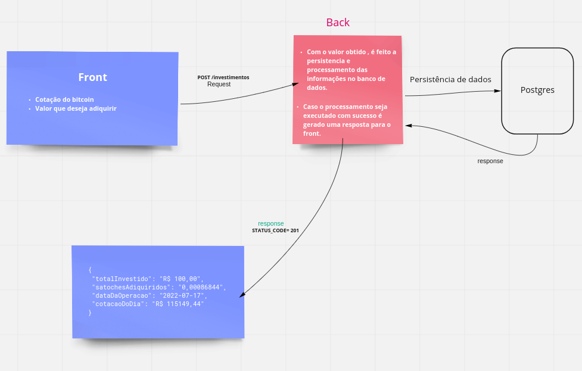

### 1 Fase : criar comunição
- Objetivo: criar aplicação que receba o valor da cotação da compra do bitcoin e o valor que será investido. 
    - os dados obtidos devem ser processados e armazenados no banco de dados guardando todos os dados necessarios para geração de relatórios futuros.
