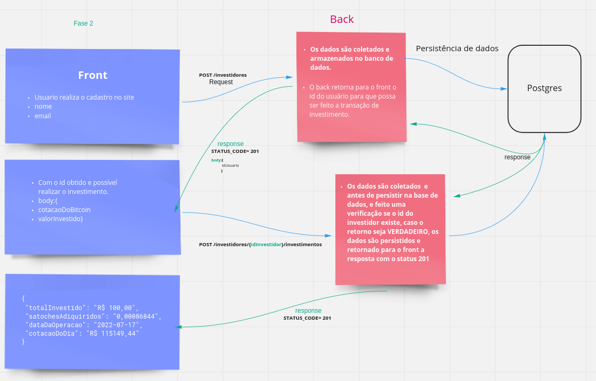

### 1 Fase : criar comunição
- Objetivo: criar aplicação que receba o valor da cotação da compra do bitcoin e o valor que será investido. 
    - os dados obtidos devem ser processados e armazenados no banco de dados guardando todos os dados necessarios para geração de relatórios futuros.

### 2 Fase: evolução do fluxo.

Entidade que armazenara historico de investimentos.

Dados necessario para gestrar os relatorios

TELA_De_cadastro
Data do investimento
cotacao_no_momento_do_investimento
valor_investimento
taxa_da_transacao
quantidade_arquirida
nome_do_investimento
grupo_de_investimento
quantidade_tx_transacao
